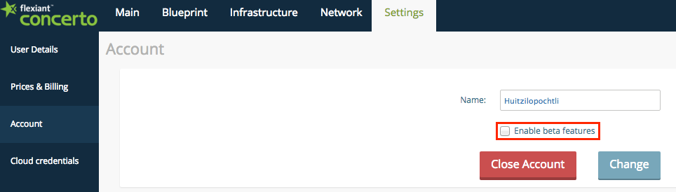

# Getting started with Kubernetes in Flexiant Concerto
[][cli_build] 

Flexiant Concerto's integration with Kubernetes allows you to deploy and maintain Kubernetes clusters using the Flexiant Concerto UI and CLI interface. 

This guide concerns how to use the Flexiant Concerto UI to create and maintain a Kubernetes cluster; for information about how to use the CLI to accomplish this, see the [CLI documentation](README.md).

# Table of Contents

- [Setup](#setup)
  - [Pre-requisites](#pre-requisites)
  - [Creating a Kubernetes cluster](#creating-a-kubernetes-cluster)
- [Usage](#usage)
- [Contribute](#contribute)

# Setup

## Pre-requisites
Before setting up Kubernetes, we will need a Flexiant Concerto account.

You can create a free account in less than a minute following the steps in Flexiant Concerto [login page](https://start.concerto.io/).

Once your account have been provisioned, add a cloud provider. After doing this, enable beta features by doing the following:

1. Navigate the menus to **Settings** > **User Details**.
2. Select the **Enable beta features** check box.

    

3. Click the **Change** button.
4. Refresh the page. After the page reloads, the **Beta** tab is displayed to the right of the **Settings** tab.

## Creating a Kubernetes cluster
To create a Kubernetes cluster:

1. Click on the **Beta** tab.
2. Click on the **Kubernetes** sub-tab.
3. Click the **Create Cluster** button.

    

4. Enter the following information:
	* Name - the name to give the cluster. This must be given in lower case characters without spaces, as it will form part of the cluster's hostname.
	* Domain - if you have more than one domain, select which one you want to create the cluster in. This is appended to the Name value to form the cluster's hostname.
	* SSH profile - if you have more than one SSH profile, select which one you want to use.
5. Click the **Add Cluster** button.

## Adding nodes to a cluster

Once your cluster is created, add nodes to it. Nodes are used to run pods, which in turn contain containers that run applications or services.

To add nodes to a cluster:

1. Click on the **Beta** tab.
2. Click on the **Kubernetes** sub-tab.
3. Click on the name of the cluster you want to add nodes to.

# Usage
We are including most common use cases here. If you miss a use case here open an issue or contact us at <contact@flexiant.com>.

# Contribute

To contribute
 - Find and open issue, or report a new one. Include proper information about the environment, at least: operating system, CLI version, steps to reproduce the issue and related issues. Avoid writing multi-issue reports, and make sure that the issue is unique.
 - Fork the repository to your account
 - Commit scoped chunks, adding concise and clear comments
 - Remember to add tests to your contributed code
 - Push changes to the forked repository
 - Submit the PR to Concerto CLI
 - Let the maintainers give you the LGTM.

Please, use gofmt, golint, go vet, and follow [go style](https://github.com/golang/go/wiki/CodeReviewComments) advices

[cli_build]: https://drone.io/github.com/flexiant/concerto/latest
[cli_linux]: https://drone.io/github.com/flexiant/concerto/files/concerto.x64.linux
[cli_darwin]: https://drone.io/github.com/flexiant/concerto/files/concerto.x64.darwin
[cli_windows]: https://drone.io/github.com/flexiant/concerto/files/concerto.x64.windows.exe
