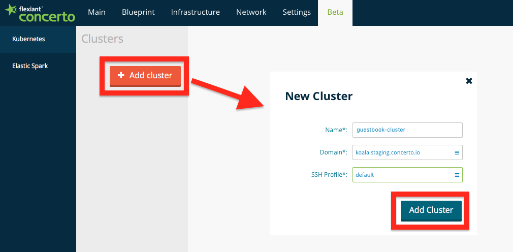
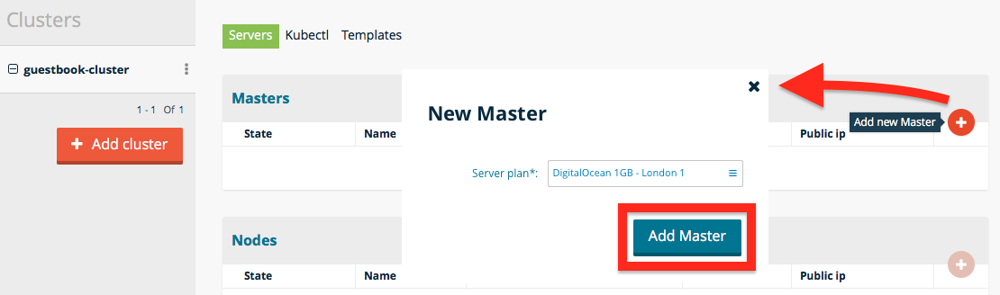
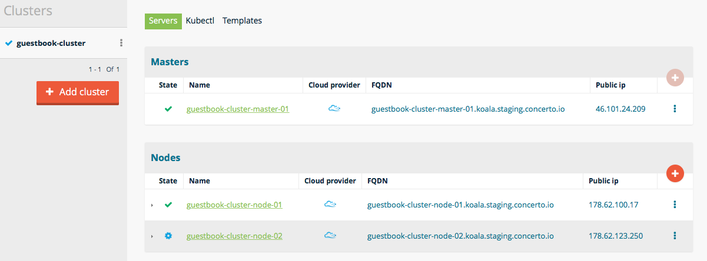
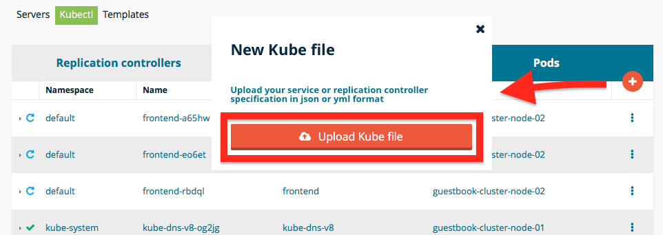
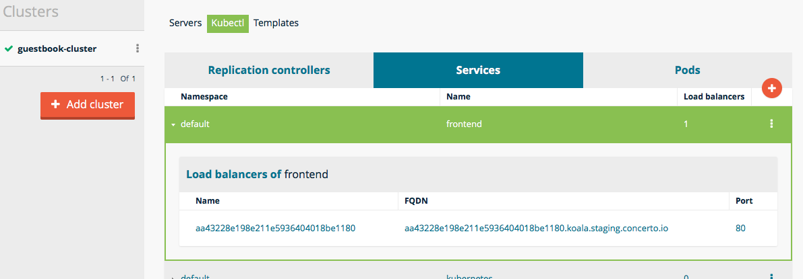
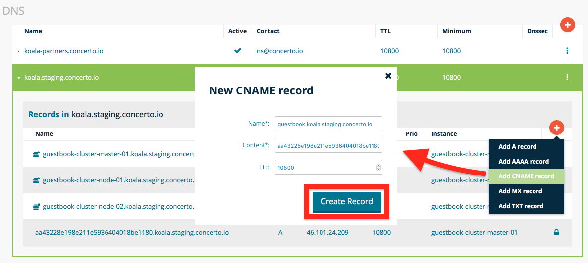
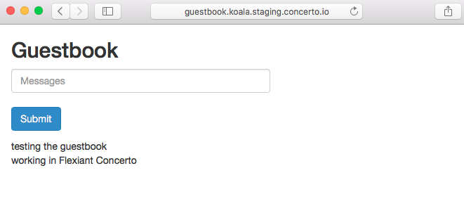

# Kubernetes Guestbook example in Flexiant Concerto
[][cli_build] [](https://godoc.org/github.com/flexiant/concerto)

Flexiant Concerto's integration with Kubernetes allows you to deploy and maintain Kubernetes clusters using the Flexiant Concerto UI and CLI interface.

This guide concerns how to run the Kubernetes Guestbook example using Flexiant Concerto UI; for an introduction of Kubernetes in Flexiant Concerto see [Getting Started with Kubernetes](Getting started with Kubernetes.md).

# Table of Contents

- [Setup](#setup)
  - [Pre-requisites](#pre-requisites)
  - [Creating the Kubernetes cluster](#creating-the-kubernetes-cluster)
  - [Deploying the Guestbook example](#deploying-the-guestbook-example)
  - [Creating a friendly URL](#creating-a-friendly-url)
  - [Access the Guestbook](#access-the-guestbook)
- [Contact](#contact)


# Setup

## Pre-requisites

Before setting up the Kubernetes Guestbook example, we will need:

 - A Flexiant Concerto account.
 - Cloud credentials for those providers you'd like to deploy the example on.
 - Enable Beta features for your Flexiant Concerto account.
 - (Optional) A domain to customize the example's URL.

Please, refer to [Getting Started with Kubernetes](Getting started with Kubernetes.md).

## Creating the Kubernetes cluster

1. Create the kubernetes cluster

  

2. Add a master node, of at least 1GB RAM

   

3. Add one or several slave nodes

   

## Deploying the Guestbook example

Once your cluster is running, create the replication controllers and services that will run and expose the Guestbook application.

1. Download and customize Guestbook files

Access the [Kubernetes Guestbook Example](https://github.com/kubernetes/kubernetes/blob/master/examples/guestbook/php-redis/guestbook.php) and download all yaml files.

2. Modify frontend service type to use Flexiant Concerto load balancer. Edit `frontend-service.yaml` Uncomment the line that allows load balancing.

```
...
spec:
  # if your cluster supports it, uncomment the following to automatically create
  # an external load-balanced IP for the frontend service.
   type: LoadBalancer
...
```

3. Once the nodes are running, upload guestbook files following the example's instructions.
  1. Upload the master service.
  2. Upload the master controller and wait for the pod to be running.
  3. Upload the slaves service.
  4. Upload the slaves controller and wait for the pods to be running.
  5. Upload the front-end service.
  6. Upload the front-end controller and wait for the pods to be running.

   

## Creating a friendly URL

The guestbook is now available at a random generated subdomain. You can customize the DNS subdomain using Flexiant Concerto DNS management.

 1. Get the front-end's current FQDN. You can find it at the cluster's Service tab.

	

 2. Get to Network >> DNS and expand your cluster's DNS. Add a new CNAME record with your chosen prefix pointing to the front-end's FQDN.

 

## Access the Guestbook

Access the guestbook using the default generated domain or your own alias.

 

# Contact
If you want to have further information about Flexiant Concerto, you can contact us at <contact@flexiant.com>.


[cli_build]: https://drone.io/github.com/flexiant/concerto/latest
[cli_linux]: https://drone.io/github.com/flexiant/concerto/files/concerto.x64.linux
[cli_darwin]: https://drone.io/github.com/flexiant/concerto/files/concerto.x64.darwin
[cli_windows]: https://drone.io/github.com/flexiant/concerto/files/concerto.x64.windows.exe
