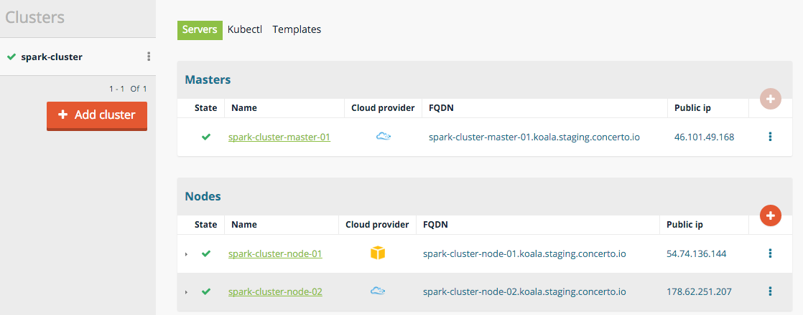
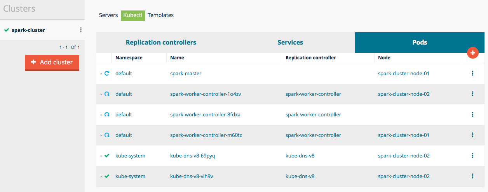

# Kubernetes Spark example in Flexiant Concerto
[][cli_build] 

Flexiant Concerto's integration with Kubernetes allows you to deploy and maintain Kubernetes clusters using the Flexiant Concerto UI and CLI interface.

This guide concerns how to run the Kubernetes Guestbook example using Flexiant Concerto UI; for an introduction of Kubernetes in Flexiant Concerto see [Getting Started with Kubernetes](Getting started with Kubernetes.md).

It is also recommended to follow [Kubernetes Guestbook example](Kubernetes Guestbook example in Flexiant Concerto.md) before running the Spark example.

# Table of Contents

- [Setup](#setup)
  - [Pre-requisites](#pre-requisites)
  - [Creating the Kubernetes cluster](#creating-the-kubernetes-cluster)
  - [Deploying the Spark example](#deploying-the-spark-example)
  - [Launch Spark works](#launch-spark-works)
- [Contact](#contact)

# Setup

## Pre-requisites

Before setting up the Kubernetes Spark example, we will need:

 - A Flexiant Concerto account.
 - Cloud credentials for those providers you'd like to deploy the example on.
 - Enable Beta features for your Flexiant Concerto account.
 - (Optional) A domain to customize the example's URL.

Please, refer to [Getting Started with Kubernetes](Getting started with Kubernetes.md).

## Creating the Kubernetes cluster

1. Create the kubernetes cluster
2. Add a master node of at least 1GB RAM
3. Add several slave nodes of at least 2GB RAM.

For screen samples, see follow [Kubernetes Guestbook example](Kubernetes Guestbook example in Flexiant Concerto.md#creating-the-kubernetes-cluster)

   

## Deploying the Spark example

Once your cluster is running, create the replication controllers and services that will run and expose the Spark application.

1. Download Spark example files.

Access the [Kubernetes Spark Example](https://github.com/kubernetes/kubernetes/tree/v1.0.7/examples/spark) and download all json files.

(Please, note that we are refering to a fixed example version, and not to the master branch's version.)

2. Upload Spark files following the example's instructions.
  1. Upload the spark master pod.
  2. Upload the spark master service.
  3. Upload the spark workers controller and wait for the pods to be running.

   

   If the pods remain pending, you might want to use bigger machines in your cluster, or reduce the number of spark worker nodes.

## Launch Spark works

Follow [Kubernetes Spark Example](https://github.com/kubernetes/kubernetes/tree/v1.0.7/examples/spark) guide to execute work loads. If a worker hangs, try adding nodes with higher memory.

# Contact
If you want to have further information about Flexiant Concerto, you can contact us at <contact@flexiant.com>.

[cli_build]: https://drone.io/github.com/flexiant/concerto/latest
[cli_linux]: https://drone.io/github.com/flexiant/concerto/files/concerto.x64.linux
[cli_darwin]: https://drone.io/github.com/flexiant/concerto/files/concerto.x64.darwin
[cli_windows]: https://drone.io/github.com/flexiant/concerto/files/concerto.x64.windows.exe
