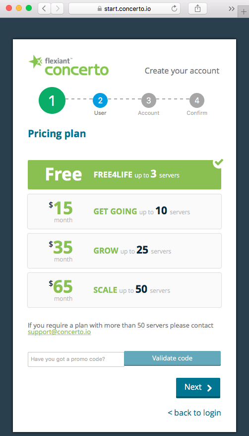

# Concerto CLI / Go Library
[][cli_build] [](https://godoc.org/github.com/flexiant/concerto)

Flexiant Concerto Command Line Interface allows you to interact with Concerto features, and build your own scripts calling Concerto's API.

If you already know Concerto CLI, and only want to obtain the latest version, download Concerto CLI for:
- [Linux][cli_linux]
- [OSX][cli_darwin]
- [Windows][cli_windows]

If you want to build the CLI using the source code, please, take into account that the master branch is used for development, it is unstable and might be broken. Download stable tagged versions to use Flexiant Concerto CLI.

# Setup

## Pre-requisites
Before setting up the CLI, we will need a Flexiant Concerto account, and an API key associated with your account.

You can create a free account in less than a minute following the steps in Flexiant Concerto [login page](https://start.concerto.io/).



Once your account have been provisioned, navigate the menus to `Settings` > `User Details`
and scroll down until you find the `New API key` button.


Pressing `New API Key` will download a compressed file that contains the necessary files to manage authenticate with Concerto API and manage your infrastructure. Keep it safe.

Extract the contents with your zip compressor of choice and continue using the setup guide for your O.S.

## Linux and OSX
### Configuration
Concerto configuration will usually be located in your personal folder under `.concerto`. If you are using root, concerto will look for contiguration files under `/etc/concerto`.
We will assume that you are not root, so create the folder and drop the certificates to this location:
```
$ mkdir -p ~/.concerto/ssl/
$ unzip -x api-key.zip -d ~/.concerto/ssl
```

Concerto CLI expects a configuration file to be present containing:
 - API Endpoint
 - Log file
 - Log level
 - Certificate location

This command will generate the file `~/.concerto/client.xml` with suitable contents for most users:
```
$ cat <<EOF > ~/.concerto/client.xml
<concerto version="1.0" server="https://clients.concerto.io:886/" log_file="/var/log/concerto-client.log" log_level="info">
 <ssl cert="$HOME/.concerto/ssl/cert.crt" key="$HOME/.concerto/ssl/private/cert.key" server_ca="$HOME/.concerto/ssl/ca_cert.pem" />
</concerto>
EOF
```

We should have in our `.concerto` folder this structure:
```
/Users/myuser/.concerto
├── client.xml
└── ssl
    ├── ca_cert.pem
    ├── cert.crt
    └── private
        └── cert.key
```
### Binaries
Download linux binaries from for [Linux][cli_linux] or for [OSX][cli_darwin] and place it in your path.

Linux:
```
sudo curl -o /usr/bin/concerto https://drone.io/github.com/flexiant/concerto/files/concerto.x64.linux
sudo chmod +x /usr/bin/concerto
```

OSX:
```
sudo curl -o /usr/bin/concerto https://drone.io/github.com/flexiant/concerto/files/concerto.x64.darwin
sudo chmod +x /usr/bin/concerto
```

To test the binary execute concerto without parameters
```
$ concerto
NAME:
   concerto - Manages comunication between Host and Concerto Platform
USAGE:
   concerto [global options] command [command options] [arguments...]
VERSION:
   0.1.0
AUTHOR(S):
   Concerto Contributors <https://github.com/flexiant/concerto>
COMMANDS:
   firewall	Manages Firewall Policies within a Host
   scripts	Manages Execution Scripts within a Host
...
```
To test that certificates are valid, and that we can communicate with Concerto server, obtain the list of workspaces at your Concerto account using this command
```
$ concerto cloud  workspaces list
ID                         NAME                  DEFAULT        DOMAIN ID                  SSH PROFILE ID             FIREWALL PROFILE ID
56017273fef51ac13400002c   default               true           5601726ffef51ac134000028   56017273fef51ac13400002b   56017273fef51ac13400002a
56388361cfda105f6e000502   Wordpress_workspace   false          5601726ffef51ac134000028   56017273fef51ac13400002b   56388360cfda105f6e000501
```

###Troubleshooting
If you got an error executing concerto CLI:
 - execute `which concerto` or `whereis concerto` to make sure that the binary is installed
 - execute ls -l /path/to/concerto with the output from the previous command, and check that you have execute permissions
 - execute `$PATH` and search for the path where concerto is installed. If concerto isn't in the path, move it to a $PATH location.
 - check that your internet connection can reach clients.concerto.io
 - make sure that your firewall lets you access to https://clients.concerto.io:886
 - check that  client.xml is pointing to the correct certificates location
 - if concerto executes but only shows server commands, you are probably trying to use concerto from a commissioned server, and the configuration is being read from `/etc/concerto`. If that's the case, you should leave concerto configuration untouched so that server commands are available for our remote management.


# Usage
We are including most common use cases here. If you can't wait for them, please, contact us at <contact@flexiant.com>.

## Wizard
Wizard command for Concerto CLI is the command line version of our `Quick add server` in Concerto Web UI.


Wizard is the quickest way to install a well known stack in a cloud server. You can get an idea of what the wizard does using the command `concerto wizard` without further subcommands:
```
$ concerto wizard
NAME:
   concerto wizard - Manages wizard related commands for apps, locations, cloud providers, server plans
USAGE:
   concerto wizard command [command options] [arguments...]
COMMANDS:
   apps         Provides information about apps
   cloud_providers  Provides information about cloud providers
   locations        Provides information about locations
   server_plans     Provides information about server plans
   help, h      Shows a list of commands or help for one command
OPTIONS:
   --help, -h   show help
```

Concerto Wizard lets you select the application layer, the location, the cloud provider for that location, and finally the hostname. Concerto Wizard takes care of the details.


If you haven't configured you cloud provider account yet, you can do it from the Concerto Web UI, or using `concerto settings cloud_accounts` commands

### Wizard Use Case
Let's type concerto wizard apps list to check what servers can I instantiate using Concerto wizard
```
concerto wizard apps list
ID                         NAME              FLAVOUR REQUIREMENTS       GENERIC IMAGE ID
53f0f126d8a5975a1c000425   Ubuntu 12.04      {}                         53f0f0e3d8a5975a1c000070
53f0f126d8a5975a1c000426   Windows 2008 R2   {"memory":2048}            53f0f0e3d8a5975a1c000071
53f0f126d8a5975a1c000427   BigBlueButton     {"memory":2048,"cpus":2}   5409b147d8a597d977000001
53f0f126d8a5975a1c000428   Joomla            {"memory":1024}            53f0f0e3d8a5975a1c000070
53f0f126d8a5975a1c000429   Magento           {"memory":1024}            53f0f0e3d8a5975a1c000070
53f0f126d8a5975a1c00042a   MongoDB           {}                         53f0f0e3d8a5975a1c000070
53f0f126d8a5975a1c00042b   Wordpress         {"memory":2048}            53f0f0e3d8a5975a1c000070
5409b197d8a597d977000010   Docker            {}                         5409b147d8a597d977000001
```
You can choose whatever application/stack is fine for your purpose, we choose Wordpress. Take note of the application identifier, `53f0f126d8a5975a1c00042b` for Wordpress.
We will also need the location where we want our server to be instantiated. Execute concerto wizard locations list to get the possible locations and its identifier.
```
$ concerto wizard locations list
ID                          NAME
53f0f0e2d8a5975a1c00006b    USA
53f0f0e2d8a5975a1c00006c    Europe
53f0f0e2d8a5975a1c00006d    Asia Pacific
53f0f0e2d8a5975a1c00006e    South America
```
Take note of your preferred location. We will use `53f0f0e2d8a5975a1c00006c` for Europe.

When using Concerto's Web UI, the wizard takes care of filtering appropriate cloud providers for that location. However, using the CLI is the user's responsibility to chose a cloud provider and a server plan capable of instantiating the stack in that location. To show all possible providers execute this command:
```
$ concerto cloud cloud_providers list
ID                         NAME                  REQUIRED CREDENTIALS                                   PROVIDED SERVICES
53f0f099d8a5975a1c000001   Linode                [api_key]                                              [server]
53f0f099d8a5975a1c000002   AWS                   [access_key_id secret_access_key]                      [server]
53f0f09ad8a5975a1c000003   GoGrid                [api_key shared_secret]                                [server]
53f0f09ad8a5975a1c000004   Rackspace First Gen   [username auth_key]                                    [load_balancer server]
53f0f09ad8a5975a1c000005   Rackspace US          [username api_key]                                     [server]
53f0f09ad8a5975a1c000006   Rackspace UK          [username api_key]                                     [server]
53f0f09ad8a5975a1c000008   Arsys                 [user api_key id_panel]                                [server]
53f0f09ad8a5975a1c000009   CloudSigma ZRH        [username password]                                    [server]
53f0f09ad8a5975a1c00000c   Acens                 [user password]                                        [server]
53f0f09ad8a5975a1c00000e   Joyent                [username password]                                    [server]
53f0f09ad8a5975a1c000010   DigitalOcean          [api_key client_id]                                    [server]
5481a5a54b118a685d00057a   Orixcom Orixcloud     [user api_key password]                                [server]
54b7d6b4d8a5974f2c000001   Google Compute        [google_project google_client_email cert_google_key]   [server]
54b7d6b5d8a5974f2c000002   Microsoft Azure       [subscription_id cert_management_certificate]          [server]
5579b79bd8a5978602000002   Softlayer             [username api_key]                                     [server]
```
Take also into account that you should have configured your credentials before, using the Web UI or concerto settings cloud_accounts create. We will choose Digital Ocean, whose ID is `53f0f09ad8a5975a1c000010`.


The server's FQDN will be formed using one of your domains, and a given hostname. You can bring your own domains using Concerto Web UI or CLI command concerto dns_domains subcommands.
```
$ concerto dns_domains list
ID NAME TTL CONTACT MINIMUM ENABLED
5601726ffef51ac134000028 concertointernal.concerto.io 10800 ns@concerto.io 10800 true
```
We have only the default domain. Take note of its ID, `5601726ffef51ac134000028`, and choose a hostname suffix for the new server.

Now that we have all the data that we need, commission the server:
```
$ concerto wizard apps deploy \
 -id 53f0f126d8a5975a1c00042b \
 --location_id 53f0f0e2d8a5975a1c00006c \
 --cloud_provider_id 53f0f09ad8a5975a1c000010 \
 --hostname wpnode1 \
 --domain_id 5601726ffef51ac134000028
```

We have a new server template and a workspace with a commissioned server in Concerto.


From the command line, get the new workspace, and then our commissioned server ID.
```
$concerto cloud  workspaces list
ID                         NAME                  DEFAULT        DOMAIN ID                  SSH PROFILE ID             FIREWALL PROFILE ID
56017273fef51ac13400002c   default               true           5601726ffef51ac134000028   56017273fef51ac13400002b   56017273fef51ac13400002a
563a003b97d0ad20f3000d56   Wordpress_workspace   false          5601726ffef51ac134000028   56017273fef51ac13400002b   56388360cfda105f6e000501
```
```
$ concerto cloud workspaces list_workspace_servers --workspace_id 563a003b97d0ad20f3000d56
ID                         NAME           FQDN                                   STATE          PUBLIC IP      WORKSPACE ID               TEMPLATE ID                SERVER PLAN ID             SSH PROFILE ID
563a003c97d0ad20f3000d57   wpnode1        wpnode1.concertointernal.concerto.io   inactive       0.0.0.0        563a003b97d0ad20f3000d56   563a003797d0ad20f3000d53   53f0f10fd8a5975a1c00039d   56017273fef51ac13400002b
```
Our server's ID is `563a003c97d0ad20f3000d57`. We can now use concerto cloud servers subcommands to manage the server. Lets bring wordpress up:
```
$ concerto cloud servers boot --id 563a003c97d0ad20f3000d57
```

After a brief amount of time you will have your new Worpress server up and running, ready to be configured.


# Contribute

To contribute
 - Find and open issue, or report a new one. Include proper information about the environment, at least: operating system, CLI version, steps to reproduce the issue and related issues. Avoid writing multi-issue reports, and make sure that the issue is unique.
 - Fork the repository to your account
 - Commit scoped chunks, adding concise and clear comments
 - Remember to add tests to your contributed code
 - Push changes to the forked repository
 - Submit the PR to Concerto CLI
 - Let the maintainers give you the LGTM.

Please, use gofmt, golint, go vet, and follow [go style](https://github.com/golang/go/wiki/CodeReviewComments) advices

[cli_build]: https://drone.io/github.com/flexiant/concerto/latest
[cli_linux]: https://drone.io/github.com/flexiant/concerto/files/concerto.x64.linux
[cli_darwin]: https://drone.io/github.com/flexiant/concerto/files/concerto.x64.darwin
[cli_windows]: https://drone.io/github.com/flexiant/concerto/files/concerto.x64.windows.exe
