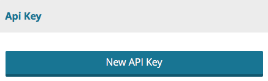
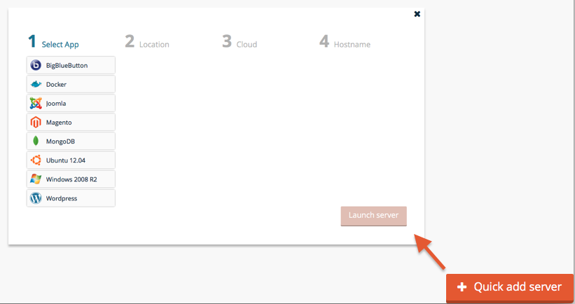
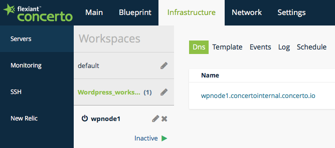
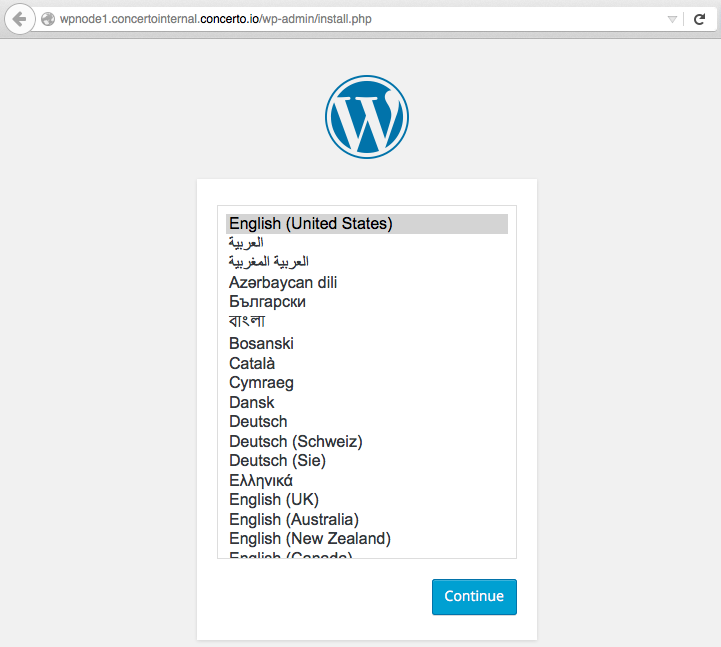

# Concerto CLI / Go Library
[][cli_build] [](https://godoc.org/github.com/flexiant/concerto)

Flexiant Concerto Command Line Interface allows you to interact with Concerto features, and build your own scripts calling Concerto's API.

If you are already using Concerto CLI, and only want to obtain the latest version, download Concerto CLI for:
- [Linux][cli_linux]
- [OSX][cli_darwin]
- [Windows][cli_windows]

If you want to build the CLI using the source code, please, take into account that the master branch is used for development, it is unstable and might be broken. Download stable tagged versions to use Flexiant Concerto CLI.

# Table of Contents

- [Setup](#setup)
  - [Pre-requisites](#pre-requisites)
  - [Linux and OSX](#linux-and-osx)
    - [Configuration](#configuration)
    - [Binaries](#binaries)
    - [Troubleshooting](#troubleshooting)
- [Usage](#usage)
  - [Wizard](#wizard)
    - [Wizard Use Case](#wizard-use-case)
  - [Blueprint](#blueprint)
    - [Blueprint Use Case](#blueprint-use-case)
      - [ Template OS](#template-os)
      - [Service List](#service-list)
      - [Instantiate a server](#instantiate-a-server)
  - [Kubernetes Cluster](#kubernetes-cluster)
    - [Kubernetes Use Case](#kubernetes-use-case)
  - [Firewall Management](#firewall-management)
    - [Firewall Update Case](#firewall-update-case)
  - [Blueprint Update](#blueprint-update)
    - [Blueprint Update Case](#blueprint-update-case)
- [Contribute](#contribute)


# Setup

## Pre-requisites
Before setting up the CLI, we will need a Flexiant Concerto account, and an API key associated with your account.

You can create a free account in less than a minute following the steps in Flexiant Concerto [login page](https://start.concerto.io/).

Once your account have been provisioned, navigate the menus to `Settings` > `User Details`
and scroll down until you find the `New API key` button.



Pressing `New API Key` will download a compressed file that contains the necessary files to authenticate with Concerto API and manage your infrastructure. Keep it safe.

Extract the contents with your zip compressor of choice and continue using the setup guide for your O.S.

## Linux and OSX
### Configuration
Concerto configuration will usually be located in your personal folder under `.concerto`. If you are using root, concerto will look for contiguration files under `/etc/concerto`.
We will assume that you are not root, so create the folder and drop the certificates to this location:
```
$ mkdir -p ~/.concerto/ssl/
$ unzip -x api-key.zip -d ~/.concerto/ssl
```

Concerto CLI expects a configuration file to be present containing:
 - API Endpoint
 - Log file
 - Log level
 - Certificate location

This command will generate the file `~/.concerto/client.xml` with suitable contents for most users:
```
$ cat <<EOF > ~/.concerto/client.xml
<concerto version="1.0" server="https://clients.concerto.io:886/" log_file="/var/log/concerto-client.log" log_level="info">
 <ssl cert="$HOME/.concerto/ssl/cert.crt" key="$HOME/.concerto/ssl/private/cert.key" server_ca="$HOME/.concerto/ssl/ca_cert.pem" />
</concerto>
EOF
```

We should have in our `.concerto` folder this structure:
```
/Users/myuser/.concerto
├── client.xml
└── ssl
    ├── ca_cert.pem
    ├── cert.crt
    └── private
        └── cert.key
```
### Binaries
Download linux binaries for [Linux][cli_linux] or for [OSX][cli_darwin] and place it in your path.

Linux:
```
sudo curl -o /usr/local/bin/concerto https://drone.io/github.com/flexiant/concerto/files/concerto.x64.linux
sudo chmod +x /usr/local/bin/concerto
```

OSX:
```
sudo curl -o /usr/local/bin/concerto https://drone.io/github.com/flexiant/concerto/files/concerto.x64.darwin
sudo chmod +x /usr/local/bin/concerto
```

To test the binary execute concerto without parameters
```
$ concerto
NAME:
   concerto - Manages comunication between Host and Concerto Platform
USAGE:
   concerto [global options] command [command options] [arguments...]
VERSION:
   0.1.0
AUTHOR(S):
   Concerto Contributors <https://github.com/flexiant/concerto>
COMMANDS:
   firewall	Manages Firewall Policies within a Host
   scripts	Manages Execution Scripts within a Host
...
```
To test that certificates are valid, and that we can communicate with Concerto server, obtain the list of workspaces at your Concerto account using this command
```
$ concerto cloud  workspaces list
ID                         NAME                  DEFAULT        DOMAIN ID                  SSH PROFILE ID             FIREWALL PROFILE ID
56017273fef51ac13400002c   default               true           5601726ffef51ac134000028   56017273fef51ac13400002b   56017273fef51ac13400002a
56388361cfda105f6e000502   Wordpress_workspace   false          5601726ffef51ac134000028   56017273fef51ac13400002b   56388360cfda105f6e000501
```

###Troubleshooting
If you got an error executing concerto CLI:
 - execute `which concerto` or `whereis concerto` to make sure that the binary is installed
 - execute ls -l /path/to/concerto with the output from the previous command, and check that you have execute permissions
 - execute `$PATH` and search for the path where concerto is installed. If concerto isn't in the path, move it to a `$PATH` location.
 - check that your internet connection can reach clients.concerto.io
 - make sure that your firewall lets you access to https://clients.concerto.io:886
 - check that  client.xml is pointing to the correct certificates location
 - if concerto executes but only shows server commands, you are probably trying to use concerto from a commissioned server, and the configuration is being read from `/etc/concerto`. If that's the case, you should leave concerto configuration untouched so that server commands are available for our remote management.


# Usage
We are including most common use cases here. If you miss a use case here open an issue or contact us at <contact@flexiant.com>.

## Wizard
Wizard command for Concerto CLI is the command line version of our `Quick add server` in Concerto Web UI.



Wizard is the quickest way to install a well known stack in a cloud server. You can get an idea of what the wizard does using the command `concerto wizard` without further subcommands:
```
$ concerto wizard
NAME:
   concerto wizard - Manages wizard related commands for apps, locations, cloud providers, server plans
USAGE:
   concerto wizard command [command options] [arguments...]
COMMANDS:
   apps         Provides information about apps
   cloud_providers  Provides information about cloud providers
   locations        Provides information about locations
   server_plans     Provides information about server plans
   help, h      Shows a list of commands or help for one command
OPTIONS:
   --help, -h   show help
```

Concerto Wizard lets you select the application layer, the location, the cloud provider for that location, and finally the hostname. Concerto Wizard takes care of the details.


If you haven't configured you cloud provider account yet, you can do it from the Concerto Web UI, or using `concerto settings cloud_accounts` commands

### Wizard Use Case
Let's type concerto wizard apps list to check what servers can I instantiate using Concerto wizard
```
concerto wizard apps list
ID                         NAME              FLAVOUR REQUIREMENTS       GENERIC IMAGE ID
53f0f126d8a5975a1c000425   Ubuntu 12.04      {}                         53f0f0e3d8a5975a1c000070
53f0f126d8a5975a1c000426   Windows 2008 R2   {"memory":2048}            53f0f0e3d8a5975a1c000071
53f0f126d8a5975a1c000427   BigBlueButton     {"memory":2048,"cpus":2}   5409b147d8a597d977000001
53f0f126d8a5975a1c000428   Joomla            {"memory":1024}            53f0f0e3d8a5975a1c000070
53f0f126d8a5975a1c000429   Magento           {"memory":1024}            53f0f0e3d8a5975a1c000070
53f0f126d8a5975a1c00042a   MongoDB           {}                         53f0f0e3d8a5975a1c000070
53f0f126d8a5975a1c00042b   Wordpress         {"memory":2048}            53f0f0e3d8a5975a1c000070
5409b197d8a597d977000010   Docker            {}                         5409b147d8a597d977000001
```
You can choose whatever application/stack is fine for your purpose, we choose Wordpress. Take note of the application identifier, `53f0f126d8a5975a1c00042b` for Wordpress.
We will also need the location where we want our server to be instantiated. Execute concerto wizard locations list to get the possible locations and its identifier.
```
$ concerto wizard locations list
ID                          NAME
53f0f0e2d8a5975a1c00006b    USA
53f0f0e2d8a5975a1c00006c    Europe
53f0f0e2d8a5975a1c00006d    Asia Pacific
53f0f0e2d8a5975a1c00006e    South America
```
Take note of your preferred location. We will use `53f0f0e2d8a5975a1c00006c` for Europe.

When using Concerto's Web UI, the wizard takes care of filtering appropriate cloud providers for that location. However, using the CLI is the user's responsibility to chose a cloud provider and a server plan capable of instantiating the stack in that location. To show all possible providers execute this command:
```
$ concerto cloud cloud_providers list
ID                         NAME                  REQUIRED CREDENTIALS                                   PROVIDED SERVICES
53f0f099d8a5975a1c000001   Linode                [api_key]                                              [server]
53f0f099d8a5975a1c000002   AWS                   [access_key_id secret_access_key]                      [server]
53f0f09ad8a5975a1c000003   GoGrid                [api_key shared_secret]                                [server]
53f0f09ad8a5975a1c000004   Rackspace First Gen   [username auth_key]                                    [load_balancer server]
53f0f09ad8a5975a1c000005   Rackspace US          [username api_key]                                     [server]
53f0f09ad8a5975a1c000006   Rackspace UK          [username api_key]                                     [server]
53f0f09ad8a5975a1c000008   Arsys                 [user api_key id_panel]                                [server]
53f0f09ad8a5975a1c000009   CloudSigma ZRH        [username password]                                    [server]
53f0f09ad8a5975a1c00000c   Acens                 [user password]                                        [server]
53f0f09ad8a5975a1c00000e   Joyent                [username password]                                    [server]
53f0f09ad8a5975a1c000010   DigitalOcean          [api_key client_id]                                    [server]
5481a5a54b118a685d00057a   Orixcom Orixcloud     [user api_key password]                                [server]
54b7d6b4d8a5974f2c000001   Google Compute        [google_project google_client_email cert_google_key]   [server]
54b7d6b5d8a5974f2c000002   Microsoft Azure       [subscription_id cert_management_certificate]          [server]
5579b79bd8a5978602000002   Softlayer             [username api_key]                                     [server]
```
Take also into account that you should have configured your credentials before, using the Web UI or concerto settings cloud_accounts create. We will choose Digital Ocean, whose ID is `53f0f09ad8a5975a1c000010`.


The server's FQDN will be formed using one of your domains, and a given hostname. You can bring your own domains using Concerto Web UI or CLI command concerto dns_domains subcommands.
```
$ concerto dns_domains list
ID NAME TTL CONTACT MINIMUM ENABLED
5601726ffef51ac134000028 concertointernal.concerto.io 10800 ns@concerto.io 10800 true
```
We have only the default domain. Take note of its ID, `5601726ffef51ac134000028`, and choose a hostname suffix for the new server.

Now that we have all the data that we need, commission the server:
```
$ concerto wizard apps deploy \
 -id 53f0f126d8a5975a1c00042b \
 --location_id 53f0f0e2d8a5975a1c00006c \
 --cloud_provider_id 53f0f09ad8a5975a1c000010 \
 --hostname wpnode1 \
 --domain_id 5601726ffef51ac134000028
```

We have a new server template and a workspace with a commissioned server in Concerto.


From the command line, get the new workspace, and then our commissioned server ID.
```
$concerto cloud  workspaces list
ID                         NAME                  DEFAULT        DOMAIN ID                  SSH PROFILE ID             FIREWALL PROFILE ID
56017273fef51ac13400002c   default               true           5601726ffef51ac134000028   56017273fef51ac13400002b   56017273fef51ac13400002a
563a003b97d0ad20f3000d56   Wordpress_workspace   false          5601726ffef51ac134000028   56017273fef51ac13400002b   56388360cfda105f6e000501
```
```
$ concerto cloud workspaces list_workspace_servers --workspace_id 563a003b97d0ad20f3000d56
ID                         NAME           FQDN                                   STATE          PUBLIC IP      WORKSPACE ID               TEMPLATE ID                SERVER PLAN ID             SSH PROFILE ID
563a003c97d0ad20f3000d57   wpnode1        wpnode1.concertointernal.concerto.io   inactive       0.0.0.0        563a003b97d0ad20f3000d56   563a003797d0ad20f3000d53   53f0f10fd8a5975a1c00039d   56017273fef51ac13400002b
```
Our server's ID is `563a003c97d0ad20f3000d57`. We can now use concerto cloud servers subcommands to manage the server. Lets bring wordpress up:
```
$ concerto cloud servers boot --id 563a003c97d0ad20f3000d57
```


After a brief amount of time you will have your new Worpress server up and running, ready to be configured.




## Blueprint

Flexiant Concerto blueprints are the compendium of
 - services, they map to Concerto's Web UI cookbooks. Use `concerto blueprint services list` to show all cookbooks available at your account.
 - scripts, the provide a way to execute custom scripts after bootstraping, before a clean shutdown, or on demand.
 - templates, an ordered combination of services and scripts.


### Blueprint Use Case
A template must be created with an OS target, a service list, and a list of custom attributes for those services.

#### Template OS
Blueprints are associated with an Operative System, and each cloud provider has a different way of identifying the OS that a machine is running.

Flexiant Concerto takes care of the gap, and lets you select a cloud provider independent OS, and find out later which image is appropriate for the chosen cloud provider and location. Hence blueprints are bound to OS, but cloud provider and location independent.


For our case we will be using Ubuntu 14.04. Let's find it's Concerto ID
```
$ concerto cloud generic_images list
ID                         NAME
55b0914e10c0ecc351000078   Red Hat Enterprise Linux 6 x86_64
55b0914e10c0ecc351000079   CentOS 5 x86_64
55b0914e10c0ecc35100007a   Ubuntu 10.04 Lucid Lynx x86_64
55b0914e10c0ecc35100007b   Ubuntu 12.04 Precise Pangolin x86_64
55b0914e10c0ecc35100007c   Ubuntu 14.04 Trusty Tahr x86_64
55b0914e10c0ecc35100007d   SmartOS x86_64
55b0914e10c0ecc35100007e   Windows 2008 R2 - SP1 x86_64
55b0915010c0ecc3510000a0   Windows 2012 R2 x86_64
```
Take note of Ubuntu 14.04 ID, `55b0914e10c0ecc35100007c`.

#### Service List
We want to use Concerto's curated Joomla cookbook. Use `concerto blueprint services` to find the cookbooks to add.
```
$ concerto blueprint services list | awk 'NR==1 || /joomla/'
ID                         NAME                  DESCRIPTION                                                                                                                                  PUBLIC         LICENSE                  RECIPES
563c8f4a358021214f000001   joomla                Installs/Configures joomla environment                                                                                                       false          All rights reserved      [joomla@0.10.0 joomla::appserver@0.10.0 joomla::database@0.10.0]
```

Joomla curated cookbooks creates a local mysql database. We only have to tell our cookbook that we should override the `joomla.db.hostname` to `127.0.0.1`. Execute the following command to create the Joomla template.
```
$ concerto blueprint templates create --name joomla-tmplt --generic_image_id 55b0914e10c0ecc35100007c --service_list '["joomla"]' --configuration_attributes '{"joomla":{"db":{"hostname":"127.0.0.1"}}}'
ID                         NAME           GENERIC IMAGE ID           SERVICE LIST   CONFIGURATION ATTRIBUTES
5641d1ab7aa4b1a678000039   joomla-tmplt   55b0914e10c0ecc35100007c   ["joomla"]       {"joomla":{"db":{"hostname":"127.0.0.1"}}}
```

#### Instantiate a server
Now that we have our server blueprint defined, let's start one. Servers in Concerto need to know the workspace that define their runtime infrastructure environment, the domain used to refer to the node, the server plan for the cloud provider, and the template used to build the instance.


As we did in the Wizard use case, we can find the missing data using this commands

Find the workspace
```
$ concerto cloud workspaces list
ID                         NAME           DEFAULT        DOMAIN ID                  SSH PROFILE ID             FIREWALL PROFILE ID
55b7326c0cbbc01fc2000008   default        true           55b732650cbbc01fc2000004   55b7326b0cbbc01fc2000007   55b7326b0cbbc01fc2000006
55c9eb5a23f8769d61000053   meanstack      false          55b732650cbbc01fc2000004   55b7326b0cbbc01fc2000007   55c9eb5123f8768ea9000050
55c9eb6623f876d45e000056   magento        false          55b732650cbbc01fc2000004   55b7326b0cbbc01fc2000007   55c9eb4a23f876c7f100004d
```
Find available domain names
```
$ concerto dns_domains list
ID                         NAME                         TTL            CONTACT          MINIMUM        ENABLED
55b732650cbbc01fc2000004   flexiant-concerto.concerto.io   10800          ns@concerto.io   10800          true
```
Find cloud provider server plan
```
$ concerto cloud cloud_providers list
ID                         NAME              REQUIRED CREDENTIALS                                   PROVIDED SERVICES
55b090f810c0ecc351000001   AWS               [access_key_id secret_access_key]                      [server]
55b090f810c0ecc351000002   Rackspace US      [username api_key]                                     [server]
55b090f810c0ecc351000003   Rackspace UK      [username api_key]                                     [server]
55b090f810c0ecc351000004   Mock              [nothing]                                              [load_balancer server]
55b090f810c0ecc351000005   CloudSigma ZRH    [username password]                                    [server]
55b090f810c0ecc351000006   Acens             [user password]                                        [server]
55b090f810c0ecc351000007   Instant Servers   [username password]                                    [server]
55b090f810c0ecc351000008   Joyent            [username password]                                    [server]
55b090f810c0ecc351000009   DigitalOcean      [api_key client_id personal_token]                     [server]
55b090f810c0ecc35100000a   Google Compute    [google_project google_client_email cert_google_key]   [server]
55b090f810c0ecc35100000b   Microsoft Azure   [subscription_id cert_management_certificate]          [server]
55b090f810c0ecc35100000c   Softlayer         [username api_key]                                     [server]

$ concerto cloud server_plans list --cloud_provider_id 55b090f810c0ecc351000009 | awk 'NR==1 || /London/'
ID                         NAME                                   MEMORY         CPUS           STORAGE        LOCATION ID                CLOUD PROVIDER ID
55b0916c10c0ecc351000404   DigitalOcean 512MB - London 1          512            1              20             55b0914e10c0ecc351000075   55b090f810c0ecc351000009
55b0916d10c0ecc35100040e   DigitalOcean 1GB - London 1            1024           1              30             55b0914e10c0ecc351000075   55b090f810c0ecc351000009
55b0916d10c0ecc351000418   DigitalOcean 2GB - London 1            2048           2              40             55b0914e10c0ecc351000075   55b090f810c0ecc351000009
55b0916d10c0ecc351000422   DigitalOcean 4GB - London 1            4096           2              60             55b0914e10c0ecc351000075   55b090f810c0ecc351000009
55b0916d10c0ecc35100042c   DigitalOcean 8GB - London 1            8192           4              80             55b0914e10c0ecc351000075   55b090f810c0ecc351000009
55b0916d10c0ecc351000436   DigitalOcean 16GB - London 1           16384          8              160            55b0914e10c0ecc351000075   55b090f810c0ecc351000009
55b0916d10c0ecc351000440   DigitalOcean 32GB - London 1           32768          12             320            55b0914e10c0ecc351000075   55b090f810c0ecc351000009
55b0916d10c0ecc35100044a   DigitalOcean 48GB - London 1           49152          16             480            55b0914e10c0ecc351000075   55b090f810c0ecc351000009
55b0916d10c0ecc351000454   DigitalOcean 64GB - London 1           65536          20             640            55b0914e10c0ecc351000075   55b090f810c0ecc351000009
```

We already know our template ID, but in case you want to make sure
```
$ concerto blueprint templates list
ID                         NAME           GENERIC IMAGE ID
5641c77f7260a5bdb1000150   mean           55b0914e10c0ecc35100007c
5641c7df7260a5f078000159   magento        55b0914e10c0ecc351000079
5641d1ab7aa4b1a678000039   joomla-tmplt   55b0914e10c0ecc35100007c
```

Create our Joomla Server
```
concerto cloud servers create --name joomla-node1 --fqdn joomla1.flexiant-concerto.concerto.io  --workspace_id 55b7326c0cbbc01fc2000008 --template_id 5641d1ab7aa4b1a678000039 --server_plan_id 55b0916d10c0ecc35100040e
ID                         NAME           FQDN                                 STATE           PUBLIC IP      WORKSPACE ID               TEMPLATE ID                SERVER PLAN ID             SSH PROFILE ID
5641e7497aa4b1a67800006c   joomla-node1   joomla1.flexiant-concerto.concerto.io   commissioning   0.0.0.0        55b7326c0cbbc01fc2000008   5641d1ab7aa4b1a678000039   55b0916d10c0ecc35100040e   55b7326b0cbbc01fc2000007
```

And finally boot it
```
$ concerto cloud servers boot --id 5641e7497aa4b1a67800006c
ID                         NAME           FQDN                                 STATE          PUBLIC IP      WORKSPACE ID               TEMPLATE ID                SERVER PLAN ID             SSH PROFILE ID
5641e7497aa4b1a67800006c   joomla-node1   joomla1.flexiant-concerto.concerto.io   booting        0.0.0.0        55b7326c0cbbc01fc2000008   5641d1ab7aa4b1a678000039   55b0916d10c0ecc35100040e   55b7326b0cbbc01fc2000007
```

## Kubernetes Cluster

Concerto CLI's `cluster` command lets you create and manage a Kubernetes cluster in any cloud and location you've configured within Concerto.


To get an idea of what concerto cluster does using the command without additional subcommands:
```
$ concerto cluster
NAME:
concerto cluster - Manages a Kubernetes Cluster
USAGE:
concerto cluster command [command options] [arguments...]
COMMANDS:
list 		Lists all available Clusters
start 		Starts a given Cluster
stop 		Stops a given Cluster
empty 		Empties a given Cluster
attach_net 	Attaches network to a given Cluster
create 		Creates a Cluster
delete 		Deletes a given Cluster
kubectl 	Kubectl command line wrapper
help, h 	Shows a list of commands or help for one command
OPTIONS:
--help, -h show help
```

We need kubectl in the path to manage the cluster. You can download kubectl binary from this URL replacing OS and architecture to fit your workstation

`https://storage.googleapis.com/kubernetes-release/release/v1.0.7/bin/<os>/<architecture>/kubectl`

Drop kubetcl in a location in your path.

If you are using Linux:
```
curl -L -O https://storage.googleapis.com/kubernetes-release/release/v1.0.7/bin/linux/amd64/kubectl
chmod +x kubectl
sudo mv kubectl /usr/local/bin/
```
If you are using OSX
```
curl -L -O https://storage.googleapis.com/kubernetes-release/release/v1.0.7/bin/darwin/amd64/kubectl
chmod +x kubectl
mv kubectl /usr/local/bin/
```

### Kubernetes Use Case


Before creating the cluster, we need to select the domain under which the cluster will be instantiated. You can bring your own domains using Concerto Web UI or CLI command concerto dns_domains subcommands.
```
$ concerto dns_domains list
ID                         NAME                         TTL            CONTACT          MINIMUM        ENABLED
55b732650cbbc01fc2000004   flexiant-concerto.concerto.io   10800          ns@concerto.io   10800          true
```

Use your domain ID to create the cluster.
```
$ concerto cluster create --cluster k8sConcerto --domain_id 55b732650cbbc01fc2000004
```

Now retrieve the cluster ID, since we will need allong all management operations
```
$ concerto cluster list
CLUSTER           ID                         STATE                   MASTER COUNT   SLAVE COUNT
k8sconcerto       5641fcb47aa4b1a67800007e   empty
```

To instantiate a node in our cluster, we will need a server plan. We hace already seen hoy to retrieve a server plan with the Blueprint Use Case
```
$ concerto cloud cloud_providers list | awk 'NR==1 || /DigitalOcean/'
ID                         NAME              REQUIRED CREDENTIALS                                   PROVIDED SERVICES
55b090f810c0ecc351000009   DigitalOcean      [api_key client_id personal_token]                     [server]

$ concerto cloud server_plans list --cloud_provider_id 55b090f810c0ecc351000009 | awk 'NR==1 || /1GB/ && /London/'
ID                         NAME                                   MEMORY         CPUS           STORAGE        LOCATION ID                CLOUD PROVIDER ID
55b0916d10c0ecc35100040e   DigitalOcean 1GB - London 1            1024           1              30             55b0914e10c0ecc351000075   55b090f810c0ecc351000009
```

To create a kubernetes master for this cluster, we execute this command
```
$ concerto nodes create --cluster k8sconcerto --plan 55b0916d10c0ecc35100040e
```
The kubernetes master will be commissioned and start booting. Give it some time for the cloud provider to acquire the IP, and issue this command
```
$ concerto nodes list
CLUSTER           MASTER         ID                         NAME                        FQDN                                             IP               STATE
k8sconcerto       *              56420d894579c0932e00000c   k8sconcerto-master-01       k8sconcerto-master-01.flexiant.concerto.io       178.62.111.185   bootstrapping - 10%
```
Our master is booting, wait untill it becomes operational and launch a new node. Concerto will instance first node as a master, and subsequent nodes as kubernetes slaves.
```
$ $ concerto nodes create --cluster k8sconcerto --plan 55b0916d10c0ecc35100040e
```
Now we have a kubernetes master and a slave. If you need to manage kubernetes nodes or containers use `concerto nodes` subcommands.
If you need to manage the kubernetes cluster, use `concerto cluster` subcommands.
```
$ concerto cluster kubectl --cluster k8sconcerto run single-container-pod --image=nginx
CONTROLLER             CONTAINER(S)           IMAGE(S)   SELECTOR                   REPLICAS
single-container-pod   single-container-pod   nginx      run=single-container-pod   1

concerto cluster kubectl --cluster k8sconcerto get pods
NAME                         READY     STATUS    RESTARTS   AGE
single-container-pod-0uhfr   0/1       Pending   0          56s
```

## Firewall Management
Concerto CLI's `network` command lets you manage a network settings at the workspace scope.


As we have did before, execute this command with no futher commands to get usage information:
```
$ concerto network
NAME:
   concerto network - Manages network related commands for firewall profiles and load balancers

USAGE:
   concerto network command [command options] [arguments...]

COMMANDS:
   firewall_profiles	Provides information about firewall profiles
   load_balancers	Provides information about load balancers
   help, h		Shows a list of commands or help for one command

OPTIONS:
   --help, -h	show help
```

As you can see, you can manage firewall and load balancers from Concerto CLI.

### Firewall Update Case
Workspaces in concerto are always associated with a firewall profile. By default ports 443 and 80 are open to fit most web environments, but if you are not using those ports but some others. We would need to close HTTP and HTTPS ports and open LDAP and LDAPS instead.

The first thing we will need is our workspace's related firewall identifier.
```
$ concerto cloud workspaces list
ID                         NAME                                     DEFAULT        DOMAIN ID                  SSH PROFILE ID             FIREWALL PROFILE ID
55b0911910c0ecc35100001c   default                                  true           55b0911810c0ecc351000018   55b0911810c0ecc35100001b   55b0911810c0ecc35100001a
56336b2c27062fe402000031   12factor                                 false          55cb394ec8aeb0279e00000b   55b0911810c0ecc35100001b   55b0911810c0ecc35100001a
56421fef4579c0932e000038   k8sconcerto cluster workspace 3vn6hsa4   false          55cb394ec8aeb0279e00000b   55b0911810c0ecc35100001b   56421ff04579c0932e00003c
56430aede46e2359720000e8   My New Workspace                         false          55b0911810c0ecc351000018   55b0911810c0ecc35100001b   56430bb9e46e23293f0000eb
```
We have our LDAP servers running under `My New Workspace`. If you are unsure about in which workspace are your servers running, list the servers in the workspace
```
concerto cloud workspaces list_workspace_servers --workspace_id 56430aede46e2359720000e8.
ID                         NAME                    FQDN                                        STATE          PUBLIC IP       WORKSPACE ID               TEMPLATE ID                SERVER PLAN ID             SSH PROFILE ID
564223c74579c0932e000079   openldap-1              openldap-1.concertointernal.concerto.io     inactive       46.101.3.45     56430aede46e2359720000e8   56421ff04579c0932e00003c   55b0916d10c0ecc35100040e   55b0911810c0ecc35100001b
564220cfe46e23ac580000b9   openldap-2              openldap-2.concertointernal.concerto.io     operational    178.62.104.59   56430aede46e2359720000e8   56421ff04579c0932e00003c   55b0916d10c0ecc35100040e   55b0911810c0ecc35100001b
```

Now that we have the firewall profile ID, list it's contents
```
$ concerto network firewall_profiles show --id 56430bb9e46e23293f0000eb
ID                         NAME                      DESCRIPTION    DEFAULT
56430bb9e46e23293f0000eb   My New Firewall Profile                  false
RULES:
               PROTOCOL       MIN PORT       MAX PORT       CIDR IP
               tcp            22             22
               tcp            5985           5985
               tcp            3389           3389
               tcp            443            443
               tcp            80             80
```
The first three rows are ports that Concerto may use to keep the desired state of the machine, and that will always be accessed using certificates.

When updating, we tell concerto a new set of rules. Execute the folowing command to open 389 and 686 to anyone.
```
$ concerto network firewall_profiles update --id 56430bb9e46e23293f0000eb --rules '[{"ip_protocol":"tcp", "min_port":389, "max_port":389, "source":"0.0.0.0/0"}, {"ip_protocol":"tcp", "min_port":636, "max_port":636, "source":"0.0.0.0/0"}]'
ID                         NAME                      DESCRIPTION    DEFAULT
56430bb9e46e23293f0000eb   My New Firewall Profile                  false
RULES:
               PROTOCOL       MIN PORT       MAX PORT       CIDR IP
               tcp            3389           3389           0.0.0.0/0
               tcp            5985           5985           0.0.0.0/0
               tcp            22             22             0.0.0.0/0
               tcp            389            389            0.0.0.0/0
               tcp            636            636            0.0.0.0/0
```

Firewall update returns the complete set of rules. As you can see, now LDAP and LDAPS ports are open.

## Blueprint Update
We have already used [blueprints](#blueprint) before. So you might already know that we can delete and update blueprints.

### Blueprint Update Case
Let's pretend there is an existing Joomla blueprint, and that we want to update the previous password to a safer one.

This is the Joomla blueprint that we created in a previous use case.
```
$ concerto blueprint templates show --id 56437cf41d5c6e86d7000025
ID                         NAME           GENERIC IMAGE ID           SERVICE LIST   CONFIGURATION ATTRIBUTES
56437cf41d5c6e86d7000025   joomla-tmplt   55b0914e10c0ecc35100007c   [joomla]       {"joomla":{"db":{"hostname":"127.0.0.1"}}}
```
Beware of adding previous services or configuration attributes. Update will replace existing items with the ones provided. If we don't want to lose the `joomla.db.hostname` attribute, add it to our configuretion attributes parameter:
```
$ concerto blueprint templates update --id 56437cf41d5c6e86d7000025 --configuration_attributes '{"joomla":{"db":{"hostname":"127.0.0.1", "password":"$afeP4sSw0rd"}}}'
ID                         NAME           GENERIC IMAGE ID           SERVICE LIST   CONFIGURATION ATTRIBUTES
56437cf41d5c6e86d7000025   joomla-tmplt   55b0914e10c0ecc35100007c   [joomla]       {"joomla":{"db":{"hostname":"127.0.0.1","password":"$afeP4sSw0rd"}}}
```
As you can see, non specified parameters, like name and service list, remain unchanged. Let's now change the service list, adding a two cookbooks.
```
$ concerto blueprint templates update --id 56437cf41d5c6e86d7000025  --service_list '["joomla","python@1.4.6","polipo"]'
ID                         NAME           GENERIC IMAGE ID           SERVICE LIST                         CONFIGURATION ATTRIBUTES
56437cf41d5c6e86d7000025   joomla-tmplt   55b0914e10c0ecc35100007c   ["joomla","python@1.4.6","polipo"]   {"joomla":{"db":{"hostname":"127.0.0.1","password":"$afeP4sSw0rd"}}}
```

Of course, we can change service list and configuration attributes in one command.
```
$ concerto blueprint templates update --id 56437cf41d5c6e86d7000025 --configuration_attributes '{"joomla":{"db":{"hostname":"127.0.0.1", "password":"$afeP4sSw0rd"}}}' --service_list '["joomla","python@1.4.6","polipo"]'
ID                         NAME           GENERIC IMAGE ID           SERVICE LIST                         CONFIGURATION ATTRIBUTES
56437cf41d5c6e86d7000025   joomla-tmplt   55b0914e10c0ecc35100007c   ["joomla","python@1.4.6","polipo"]   {"joomla":{"db":{"hostname":"127.0.0.1","password":"$afeP4sSw0rd"}}}
```

# Contribute

To contribute
 - Find and open issue, or report a new one. Include proper information about the environment, at least: operating system, CLI version, steps to reproduce the issue and related issues. Avoid writing multi-issue reports, and make sure that the issue is unique.
 - Fork the repository to your account
 - Commit scoped chunks, adding concise and clear comments
 - Remember to add tests to your contributed code
 - Push changes to the forked repository
 - Submit the PR to Concerto CLI
 - Let the maintainers give you the LGTM.

Please, use gofmt, golint, go vet, and follow [go style](https://github.com/golang/go/wiki/CodeReviewComments) advices

[cli_build]: https://drone.io/github.com/flexiant/concerto/latest
[cli_linux]: https://drone.io/github.com/flexiant/concerto/files/concerto.x64.linux
[cli_darwin]: https://drone.io/github.com/flexiant/concerto/files/concerto.x64.darwin
[cli_windows]: https://drone.io/github.com/flexiant/concerto/files/concerto.x64.windows.exe
